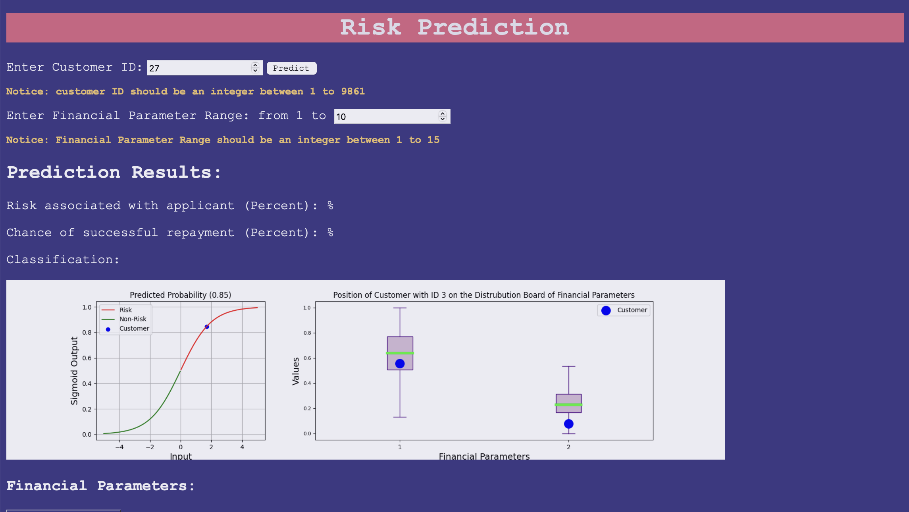
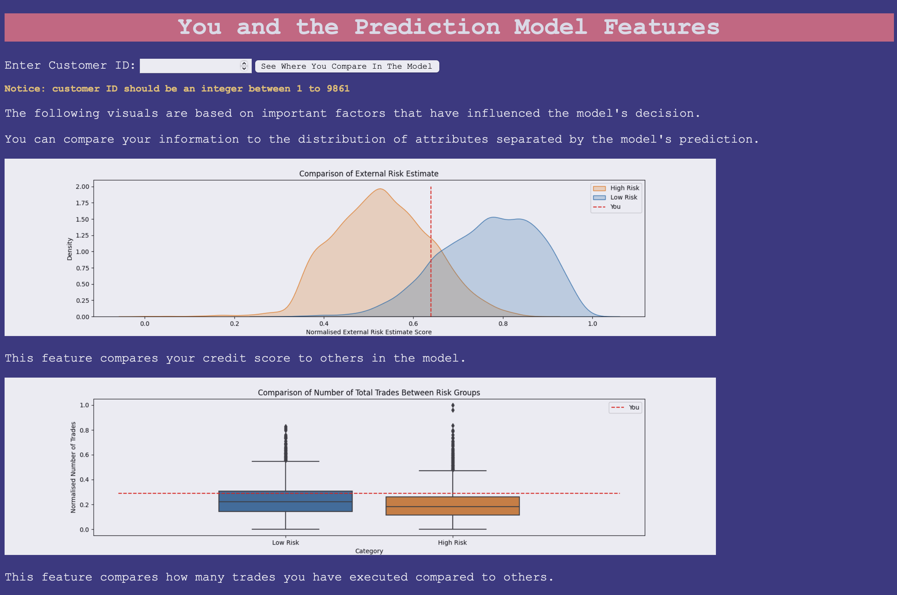

# Risk Predict 
## Explainability in Finance

Welcome to our Work Integrated Learning (WIL) project - "Explainability in Finance." In this collaborative project, we tackled a challenging data science task, aiming to create a viable Data Science product for the finance sector. We chose to work on this project using the dataset from the ["Explainable Machine Learning Challenge"](https://community.fico.com/s/explainable-machine-learning-challenge) provided by FICO.

## Project Overview

Our primary objective was to leverage data-driven techniques to enhance the explainability of machine learning models in the context of finance. We focused on creating a prediction model to evaluate risk and adapted it to provide not only binary predictions but also a general confidence level, offering valuable insights for financial decision-makers.

## Features

- **Data Cleaning:** We meticulously cleaned and prepared the dataset from the "Explainable Machine Learning Challenge" to ensure that our models were trained on high-quality, reliable data.

- **Predictive Modeling:** We built a robust predictive model capable of assessing risk, which serves as the foundation of our project's insights.

- **Explainability:** We explored techniques to make the model's predictions more interpretable and explainable, providing transparency to users.

- **Web Application:** To make our findings accessible, we developed a user-friendly web application using Flask. Users can interact with the model and gain insights into risk assessment.

- **Web Design:** We created an appealing web interface using HTML and CSS, ensuring an engaging and intuitive user experience.

## Usage

To experience our project, you can follow these steps:

1. Navigate to the "Flask_App" directory.
2. Run the "app.py" file using Python.
3. Interact with the web application to explore our risk assessment tool.

Additionally, you can find the datasets used for model training and Jupyter notebooks in the "Resources" directory, which provides further insight into our data cleaning and model development processes.

## Sample Web Page

For a detaied preview of the web pages created for our project, you can explore the "webpage_samples" directory.




## Project Structure

```plaintext
.
├── Flask_App
│   ├── Customer_DB.csv                      
│   ├── Data_with_prediction_category.csv
│   ├── app.py
│   ├── model
│   │   └── Risk_Prediction_Model.h5
│   ├── static                             # Plots
│   │   ├── external_risk_estimate.png
│   │   ├── model_explain.png
│   │   ├── num_trades.png
│   │   ├── percent_delinquency.png
│   │   ├── sigmoid_plot.png
│   │   └── stylesheet.css
│   └── templates
│       ├── index.html
│       └── info.html
├── MVP
│   ├── Min_Viable_Prod.ipynb              # Minimum Viable Product
│   ├── normalised.csv
│   ├── scaled.csv
│   └── target.csv
├── README.md
├── Resources
│   ├── Data_with_prediction_category.csv
│   ├── binary_classification.ipynb        # EDA Notebook
│   ├── cleaned.csv
│   ├── dash.ipynb                         # Dashboard using Dash
│   ├── graph_make.ipynb
│   ├── heloc_data_dictionary-2.xlsx
│   ├── heloc_dataset_v1.csv
│   ├── minimal_dataset_notebook.ipynb     # EDA Notebook
│   ├── normalised.csv
│   ├── num_trades.png
│   ├── percent_delinquency.png
│   ├── scaled.csv
│   └── target.csv
└── webpage_samples                        # Webpage Sample Images
    ├── FeatureImportance.png
    ├── InfoPage.png
    ├── InfoPageCont.png
    ├── LandingPagePreData.png
    └── LandingPageWithData.png

8 directories, 35 files

```

## Contact

If you have any questions, feedback, or would like to learn more about our project, please feel free to reach out to our team members:

- [Chris John](https://www.linkedin.com/in/chrisjohn11/)
- [Sam Mainwood](https://www.linkedin.com/in/sammainwood)
- [Junwon Lee](https://github.com/Data-JohnLee)
- Other group member LinkedIn profiles available as they are added to this ReadMe

Thank you for your interest in our "Explainability in Finance" project. We look forward to sharing our work with you and continuing our exploration of data-driven solutions in the finance industry.

